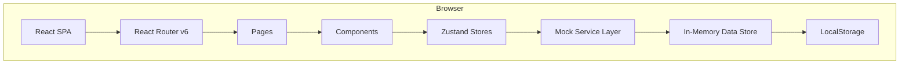
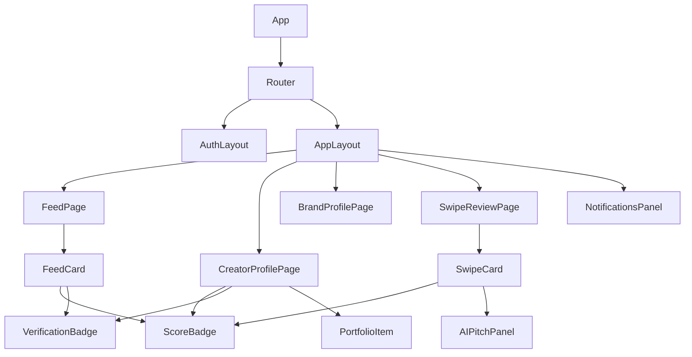

# Design Document: CreatorLink

## Overview

CreatorLink is a React single-page application (SPA) that connects content creators and brands through reputation-driven discovery. The platform replaces vanity metrics with verified trust signals — Creator Trust Scores, Brand Scores, and Collaboration Match Scores — to facilitate high-quality collaborations.

This document describes the frontend-only architecture. All data persistence, computation, and AI features are simulated via a mock data layer with deterministic algorithms running entirely in the browser.

### Key Design Principles

- **Mock-first**: No real backend. A mock data layer (static JSON + in-memory state) simulates API responses with realistic latency using `setTimeout`.
- **Role-based access**: Two distinct user roles (Creator, Brand) drive routing guards and component visibility.
- **Deterministic scoring**: All score computations are pure functions — same inputs always produce same outputs.
- **Progressive disclosure**: Complex flows (application, verification, portfolio setup) are broken into guided steps.

---

## Architecture

### Technology Stack

| Concern | Choice | Rationale |
|---|---|---|
| UI framework | React 18 + TypeScript | Type safety, large ecosystem |
| Routing | React Router v6 | Declarative routing, nested routes, lazy loading |
| State management | Zustand | Lightweight, no boilerplate, easy mock injection |
| Styling | Tailwind CSS | Utility-first, consistent design tokens |
| Mock data | Local JSON + in-memory store | Simple, zero infrastructure |
| Build tool | Vite | Fast HMR, TypeScript-first |
| Testing | Vitest + fast-check | Unit + property-based tests |

### High-Level Architecture



### Application Layers

```
src/
├── pages/           # Route-level page components
├── components/      # Reusable UI components
│   ├── auth/        # Login, Register, EmailVerification
│   ├── creator/     # CreatorProfile, Portfolio, Insights
│   ├── brand/       # BrandProfile, CampaignHistory
│   ├── feed/        # FeedCard, FeedFilters, FeedList
│   ├── application/ # ApplicationForm, AIPitchPanel
│   ├── swipe/       # SwipeCard, SwipeControls, SwipeStack
│   └── shared/      # ScoreBadge, VerificationBadge, Notification
├── stores/          # Zustand store modules
├── services/        # Mock service functions (API simulation)
├── data/            # Seed data (JSON)
├── lib/             # Score engines, AI mock utilities
├── types/           # TypeScript interfaces
├── hooks/           # Custom React hooks
└── router/          # Route definitions and guards
```

---

## Components and Interfaces

### Page Components

#### AuthPages
- `LoginPage` — Email + password form, handles unverified-email and locked-account states
- `RegisterPage` — Role selection (Creator/Brand), email + password with validation rules, redirects to email verification
- `EmailVerificationPage` — Shows verification status; provides "Resend email" action; simulates token click activation

#### Creator Pages
- `CreatorProfilePage` — Owns layout for Trust Score, Portfolio, Insights, Verification badge
- `CreatorOnboardingPage` — Post-registration wizard: content categories, social links, optional AI template generation
- `PortfolioEditorPage` — Add/edit/remove portfolio items with file upload (50 MB guard)
- `AITemplateGeneratorPage` — Requests template variants, shows 3 options, confirm/discard flow

#### Brand Pages
- `BrandProfilePage` — Brand Score, company overview, campaign history, creator ratings
- `BrandOnboardingPage` — Post-registration wizard: company info, verification document upload
- `CampaignEditorPage` — Create/edit Campaign posts
- `SwipeReviewPage` — Tinder-style application review per campaign

#### Shared Pages
- `FeedPage` — Unified feed: Brand campaign posts + Creator portfolio posts; filters; sort by Match Score
- `NotificationsPage` / `NotificationsPanel` — In-app notification list
- `VerificationFlowPage` — Step-by-step verification submission (Creator identity + social accounts, Brand business docs)

### Key Reusable Components

| Component | Props | Purpose |
|---|---|---|
| `ScoreBadge` | `score: number, type: 'trust'\|'brand'\|'match'` | Colored score pill with label |
| `VerificationBadge` | `status: VerificationStatus` | "Verified" / "Pending" / "New to Platform" indicator |
| `FeedCard` | `post: FeedPost` | Renders both campaign and portfolio posts with action buttons |
| `SwipeCard` | `application: Application, onSwipe: (dir) => void` | Draggable application card |
| `AIPitchPanel` | `pitch: string, onChange: (v) => void` | Editable AI-generated pitch |
| `PortfolioItem` | `item: PortfolioItem, editable?: boolean` | Single portfolio entry display/edit |
| `PartialDataIndicator` | `field: string` | Warning badge for missing score inputs |
| `UndoToast` | `onUndo: () => void, timeout: 5000` | 5-second undo action for swipe gestures |

### Component Hierarchy (simplified)



---

## Data Models

All models are defined as TypeScript interfaces in `src/types/`.

```typescript
// User and authentication
export type UserRole = 'creator' | 'brand';

export interface User {
  id: string;
  email: string;
  passwordHash: string;         // bcrypt hash stored in localStorage mock
  role: UserRole;
  verificationStatus: VerificationStatus;
  emailVerified: boolean;
  createdAt: string;            // ISO 8601
  failedLoginAttempts: number;
  lockedUntil: string | null;   // ISO 8601 or null
}

export type VerificationStatus = 'unverified' | 'pending' | 'verified';

// Creator
export interface Creator {
  id: string;                   // same as User.id
  userId: string;
  displayName: string;
  bio: string;
  avatarUrl: string;
  contentCategories: ContentCategory[];
  socialAccounts: SocialAccount[];
  trustScore: number;           // 0–100
  trustScorePartialData: boolean;
  portfolio: PortfolioItem[];
  collaborationHistory: CollaborationRecord[];
  insights: CreatorInsights;
  verificationStatus: VerificationStatus;
}

export type ContentCategory =
  | 'beauty'
  | 'fitness'
  | 'tech'
  | 'food'
  | 'travel'
  | 'gaming'
  | 'lifestyle'
  | 'finance'
  | 'education'
  | 'fashion';

export interface SocialAccount {
  platform: 'instagram' | 'tiktok' | 'youtube' | 'twitter' | 'linkedin';
  handle: string;
  followerCount: number;
  connected: boolean;
}

export interface PortfolioItem {
  id: string;
  creatorId: string;
  title: string;
  description: string;
  category: ContentCategory;
  mediaUrl: string;             // URL to mock media
  fileSizeBytes: number;
  campaignId: string | null;   // linked campaign if from collaboration
  metrics: PortfolioMetrics;
  createdAt: string;
}

export interface PortfolioMetrics {
  views: number;
  likes: number;
  comments: number;
  shares: number;
  engagementRate: number;       // computed: (likes+comments+shares)/views
}

export interface CreatorInsights {
  audienceDemographics: AudienceDemographics;
  primaryCategories: ContentCategory[];
  averageEngagementRate: number;
  collaborationCount: number;
  successRate: number;          // completed collaborations / total applications
}

export interface AudienceDemographics {
  ageGroups: Record<string, number>;  // e.g. { '18-24': 0.45, '25-34': 0.35 }
  topCountries: string[];
  genderSplit: { male: number; female: number; other: number };
}

// Brand
export interface Brand {
  id: string;
  userId: string;
  companyName: string;
  logoUrl: string;
  industry: string;
  description: string;
  brandScore: number;           // 0–100
  brandScorePartialData: boolean;
  isNewToPlatform: boolean;     // fewer than 3 completed collaborations
  completedCollaborations: number;
  averageCreatorRating: number;
  averageResponseTimeHours: number;
  campaigns: string[];          // Campaign IDs
  verificationStatus: VerificationStatus;
}

// Campaign
export type CompensationType = 'paid' | 'gifted' | 'commission' | 'revenue_share';
export type CampaignStatus = 'draft' | 'active' | 'paused' | 'completed' | 'removed';

export interface Campaign {
  id: string;
  brandId: string;
  title: string;
  description: string;
  requirements: string;
  contentCategories: ContentCategory[];
  compensationType: CompensationType;
  compensationAmount: number | null;
  deadline: string;             // ISO 8601
  status: CampaignStatus;
  publishedAt: string | null;
  applicantCount: number;
}

// Application
export type ApplicationStatus = 'pending' | 'approved' | 'declined' | 'waitlisted';

export interface Application {
  id: string;
  campaignId: string;
  creatorId: string;
  aiPitch: string;
  editedPitch: string;          // creator may override AI pitch
  selectedPortfolioItems: string[];  // PortfolioItem IDs (up to 3)
  status: ApplicationStatus;
  collaborationMatchScore: number;
  submittedAt: string;
  reviewedAt: string | null;
}

// Feed
export type PostType =
  | 'campaign'
  | 'portfolio_update'
  | 'campaign_result'
  | 'case_study'
  | 'creative_concept'
  | 'content_showcase';

export interface FeedPost {
  id: string;
  type: PostType;
  authorId: string;             // creatorId or brandId
  authorRole: UserRole;
  campaignId: string | null;    // set when type === 'campaign'
  title: string;
  body: string;
  category: ContentCategory;
  collaborationMatchScore: number | null;
  aiRecommendationTag: string | null;
  publishedAt: string;
  removed: boolean;
}

// Notifications
export type NotificationType =
  | 'trust_score_change'
  | 'application_approved'
  | 'application_declined'
  | 'application_received'
  | 'brand_score_change'
  | 'verification_update'
  | 'post_removed'
  | 'account_locked';

export interface Notification {
  id: string;
  userId: string;
  type: NotificationType;
  title: string;
  body: string;
  read: boolean;
  createdAt: string;
}

// Score Audit Log
export interface ScoreAuditLog {
  id: string;
  subjectId: string;            // creatorId or brandId
  subjectType: 'creator' | 'brand';
  timestamp: string;
  inputs: Record<string, number>;
  weights: Record<string, number>;
  resultingScore: number;
}

// Score input signals
export interface CreatorScoreInputs {
  audienceAuthenticity: number;     // 0–1
  commentQualityScore: number;      // 0–1
  followerGrowthPattern: number;    // 0–1 (consistent = 1, spike/drop = 0)
  engagementConsistency: number;    // 0–1
  brandCollaborationSuccessRate: number; // 0–1
}

export interface BrandScoreInputs {
  paymentReliability: number;       // 0–1
  creatorReviewScore: number;       // 0–1 (normalised average)
  campaignSuccessRate: number;      // 0–1
  communicationQualityScore: number; // 0–1
  averageResponseSpeed: number;     // 0–1 (faster = closer to 1)
}

// Collaboration record
export interface CollaborationRecord {
  campaignId: string;
  brandId: string;
  status: 'pending' | 'active' | 'completed' | 'cancelled';
  startDate: string | null;
  endDate: string | null;
}

// Portfolio template (AI generation)
export interface PortfolioTemplate {
  id: string;
  variantIndex: number;         // 1, 2, or 3
  title: string;
  suggestedCategories: ContentCategory[];
  sections: PortfolioTemplateSection[];
  isGeneric: boolean;           // true when generated without social data
}

export interface PortfolioTemplateSection {
  heading: string;
  placeholder: string;
  required: boolean;
}
```

---

## Score Computation Logic

All score computations live in `src/lib/scoreEngine.ts`. They are pure functions — deterministic and side-effect-free — making them straightforward to property-test.

### Creator Trust Score

```typescript
// Weights sum to 1.0
const CREATOR_SCORE_WEIGHTS: Record<keyof CreatorScoreInputs, number> = {
  audienceAuthenticity: 0.30,
  commentQualityScore: 0.20,
  followerGrowthPattern: 0.15,
  engagementConsistency: 0.20,
  brandCollaborationSuccessRate: 0.15,
};

export function computeCreatorTrustScore(
  inputs: Partial<CreatorScoreInputs>
): { score: number; partialData: boolean } {
  const keys = Object.keys(CREATOR_SCORE_WEIGHTS) as (keyof CreatorScoreInputs)[];
  const available = keys.filter((k) => inputs[k] !== undefined);

  if (available.length === 0) return { score: 0, partialData: true };

  const totalWeight = available.reduce((sum, k) => sum + CREATOR_SCORE_WEIGHTS[k], 0);
  const weightedSum = available.reduce(
    (sum, k) => sum + (inputs[k] as number) * CREATOR_SCORE_WEIGHTS[k],
    0
  );

  const normalised = weightedSum / totalWeight;
  const score = Math.round(Math.min(100, Math.max(0, normalised * 100)));
  return { score, partialData: available.length < keys.length };
}
```

### Brand Score

```typescript
const BRAND_SCORE_WEIGHTS: Record<keyof BrandScoreInputs, number> = {
  paymentReliability: 0.35,
  creatorReviewScore: 0.25,
  campaignSuccessRate: 0.20,
  communicationQualityScore: 0.10,
  averageResponseSpeed: 0.10,
};

export function computeBrandScore(
  inputs: Partial<BrandScoreInputs>
): { score: number; partialData: boolean } {
  // Same normalised weighted-average pattern as computeCreatorTrustScore
  const keys = Object.keys(BRAND_SCORE_WEIGHTS) as (keyof BrandScoreInputs)[];
  const available = keys.filter((k) => inputs[k] !== undefined);

  if (available.length === 0) return { score: 0, partialData: true };

  const totalWeight = available.reduce((sum, k) => sum + BRAND_SCORE_WEIGHTS[k], 0);
  const weightedSum = available.reduce(
    (sum, k) => sum + (inputs[k] as number) * BRAND_SCORE_WEIGHTS[k],
    0
  );

  const normalised = weightedSum / totalWeight;
  const score = Math.round(Math.min(100, Math.max(0, normalised * 100)));
  return { score, partialData: available.length < keys.length };
}
```

### Collaboration Match Score

```typescript
export interface MatchScoreInputs {
  creatorCategories: ContentCategory[];
  campaignCategories: ContentCategory[];
  creatorTrustScore: number;       // 0–100
  campaignMinTrustScore: number;   // 0–100 (brand's stated requirement)
  audienceAgeGroups: Record<string, number>;
  campaignTargetAgeGroups: string[];
}

export function computeCollaborationMatchScore(inputs: MatchScoreInputs): number {
  // Category overlap (weight 0.40)
  const overlap = inputs.creatorCategories.filter((c) =>
    inputs.campaignCategories.includes(c)
  ).length;
  const categoryScore =
    inputs.campaignCategories.length > 0
      ? overlap / inputs.campaignCategories.length
      : 0;

  // Trust score proximity (weight 0.35)
  const trustDelta = inputs.creatorTrustScore - inputs.campaignMinTrustScore;
  const trustScore = trustDelta >= 0 ? Math.min(1, 1 + trustDelta / 100) : Math.max(0, 1 + trustDelta / 50);

  // Audience alignment (weight 0.25)
  const targetGroups = inputs.campaignTargetAgeGroups;
  const audienceScore =
    targetGroups.length > 0
      ? targetGroups.reduce(
          (sum, g) => sum + (inputs.audienceAgeGroups[g] ?? 0),
          0
        )
      : 0.5; // neutral if no target specified

  const raw =
    categoryScore * 0.4 + trustScore * 0.35 + audienceScore * 0.25;
  return Math.round(Math.min(100, Math.max(0, raw * 100)));
}
```

### Score Audit Logging

Every call to a score computation function is wrapped by `recordScoreAudit()` in `src/lib/auditLog.ts`, which appends an immutable `ScoreAuditLog` entry to the in-memory audit store (also persisted to localStorage).

---

## AI Feature Mock Implementations

All AI features are deterministic mocks in `src/lib/aiMock.ts`. They introduce simulated latency via `Promise` + `setTimeout` to mimic real API timing.

### AI Pitch Generation

```typescript
export async function generateAIPitch(
  creator: Creator,
  campaign: Campaign
): Promise<string> {
  await simulateLatency(800, 3000); // 0.8–3 s

  const categoryOverlap = creator.contentCategories.filter((c) =>
    campaign.contentCategories.includes(c)
  );
  const topPortfolioItem = creator.portfolio
    .sort((a, b) => b.metrics.engagementRate - a.metrics.engagementRate)[0];

  return `Hi ${campaign.title} team,

I'm ${creator.displayName}, a ${categoryOverlap.join(' & ')} creator with a Creator Trust Score of ${creator.trustScore}/100. ${
    topPortfolioItem
      ? `My recent work on "${topPortfolioItem.title}" achieved a ${(topPortfolioItem.metrics.engagementRate * 100).toFixed(1)}% engagement rate, demonstrating my audience's strong connection with ${topPortfolioItem.category} content.`
      : 'I am passionate about creating authentic content that resonates with engaged communities.'
  }

Your campaign aligns perfectly with my content strategy and audience demographics. I would love to collaborate and deliver content that meets your goals around ${campaign.requirements}.

Looking forward to the possibility of working together.

${creator.displayName}`;
}
```

### AI Portfolio Template Generation

```typescript
export async function generatePortfolioTemplates(
  creator: Partial<Creator>
): Promise<PortfolioTemplate[]> {
  await simulateLatency(2000, 5000); // 2–5 s (up to 15 s requirement)
  const isGeneric = !creator.socialAccounts?.some((s) => s.connected);
  const categories = creator.contentCategories ?? ['lifestyle'];

  return [1, 2, 3].map((variantIndex) =>
    buildTemplate(variantIndex, categories, isGeneric)
  );
}

function buildTemplate(
  variantIndex: number,
  categories: ContentCategory[],
  isGeneric: boolean
): PortfolioTemplate {
  const styles = ['Minimalist', 'Story-driven', 'Data-first'];
  return {
    id: crypto.randomUUID(),
    variantIndex,
    title: `${styles[variantIndex - 1]} ${categories[0]} Portfolio`,
    suggestedCategories: categories,
    sections: buildSections(variantIndex, categories),
    isGeneric,
  };
}
```

### AI Application Ranking

Brands can request AI-ranked application lists before entering Swipe Review. The ranking is simply sorting by `collaborationMatchScore` descending — a pure, deterministic operation on already-computed scores.

```typescript
export function rankApplications(applications: Application[]): Application[] {
  return [...applications].sort(
    (a, b) => b.collaborationMatchScore - a.collaborationMatchScore
  );
}
```

---

## State Management

Four Zustand stores cover the core domains:

### `useAuthStore`
```typescript
interface AuthStore {
  currentUser: User | null;
  isAuthenticated: boolean;
  login: (email: string, password: string) => Promise<void>;
  logout: () => void;
  register: (email: string, password: string, role: UserRole) => Promise<void>;
  verifyEmail: (token: string) => Promise<void>;
  resendVerification: (email: string) => Promise<void>;
  resetPassword: (email: string) => Promise<void>;
}
```

### `useCreatorStore`
```typescript
interface CreatorStore {
  creator: Creator | null;
  loadCreator: (id: string) => Promise<void>;
  updatePortfolio: (items: PortfolioItem[]) => Promise<void>;
  refreshTrustScore: () => Promise<void>;
}
```

### `useFeedStore`
```typescript
interface FeedStore {
  posts: FeedPost[];
  filters: FeedFilters;
  loadFeed: () => Promise<void>;
  setFilters: (filters: Partial<FeedFilters>) => void;
  publishPost: (post: Omit<FeedPost, 'id' | 'publishedAt'>) => Promise<void>;
  removePost: (id: string) => void;
}

interface FeedFilters {
  category: ContentCategory | null;
  compensationType: CompensationType | null;
  deadlineBefore: string | null;
}
```

### `useSwipeStore`
```typescript
interface SwipeStore {
  queue: Application[];
  lastSwiped: Application | null;
  undoAvailable: boolean;
  loadApplications: (campaignId: string) => Promise<void>;
  rankByMatchScore: () => void;
  swipe: (applicationId: string, direction: 'approve' | 'decline' | 'waitlist') => Promise<void>;
  undo: () => Promise<void>;
}
```

---

## Routing Structure

All routes are defined in `src/router/routes.tsx`. Guards wrap route trees based on auth state and role.

### Route Map

```
/                           → Redirect to /feed (if authed) or /login
/login                      → LoginPage           [public only]
/register                   → RegisterPage        [public only]
/verify-email               → EmailVerificationPage [public]
/onboarding/creator         → CreatorOnboardingPage  [creator, unfinished setup]
/onboarding/brand           → BrandOnboardingPage    [brand, unfinished setup]

/feed                       → FeedPage            [authenticated]
/notifications              → NotificationsPage   [authenticated]

/creator/:id                → CreatorProfilePage  [authenticated]
/creator/me/portfolio       → PortfolioEditorPage [creator only]
/creator/me/ai-templates    → AITemplateGeneratorPage [creator only]
/creator/me/verification    → VerificationFlowPage   [creator only]

/brand/:id                  → BrandProfilePage    [authenticated]
/brand/me/campaigns/new     → CampaignEditorPage  [brand only]
/brand/me/campaigns/:id/edit → CampaignEditorPage [brand only]
/brand/me/campaigns/:id/review → SwipeReviewPage  [brand only]
/brand/me/verification      → VerificationFlowPage [brand only]
```

### Route Guards

```typescript
// AuthGuard — redirects to /login if not authenticated
// RoleGuard — redirects to /feed if user doesn't have required role
// PublicOnlyGuard — redirects to /feed if already authenticated

const routes = [
  { path: '/login', element: <PublicOnlyGuard><LoginPage /></PublicOnlyGuard> },
  { path: '/register', element: <PublicOnlyGuard><RegisterPage /></PublicOnlyGuard> },
  {
    element: <AuthGuard />,   // outlet-based guard
    children: [
      { path: '/feed', element: <FeedPage /> },
      { path: '/notifications', element: <NotificationsPage /> },
      { path: '/creator/:id', element: <CreatorProfilePage /> },
      {
        element: <RoleGuard role="creator" />,
        children: [
          { path: '/creator/me/portfolio', element: <PortfolioEditorPage /> },
          { path: '/creator/me/ai-templates', element: <AITemplateGeneratorPage /> },
          { path: '/creator/me/verification', element: <VerificationFlowPage /> },
        ],
      },
      { path: '/brand/:id', element: <BrandProfilePage /> },
      {
        element: <RoleGuard role="brand" />,
        children: [
          { path: '/brand/me/campaigns/new', element: <CampaignEditorPage /> },
          { path: '/brand/me/campaigns/:id/edit', element: <CampaignEditorPage /> },
          { path: '/brand/me/campaigns/:id/review', element: <SwipeReviewPage /> },
          { path: '/brand/me/verification', element: <VerificationFlowPage /> },
        ],
      },
    ],
  },
];
```

---

## Error Handling

### File Upload Validation
Portfolio uploads are validated client-side before writing to the mock store. Any file exceeding 50 MB triggers an inline error; the upload is rejected and the store is not updated.

```typescript
const MAX_FILE_SIZE_BYTES = 50 * 1024 * 1024; // 50 MB

export function validatePortfolioFile(file: File): string | null {
  if (file.size > MAX_FILE_SIZE_BYTES) {
    return `File "${file.name}" exceeds the 50 MB limit (${(file.size / 1024 / 1024).toFixed(1)} MB).`;
  }
  return null;
}
```

### Password Validation
Registration validates password strength client-side before submitting:
- Minimum 12 characters
- At least one uppercase letter
- At least one lowercase letter
- At least one digit
- At least one special character (`!@#$%^&*()_+-=[]{}|;:,.<>?`)

### Account Lockout
The mock auth service tracks `failedLoginAttempts` and `lockedUntil` on the `User` record. After 5 consecutive failures the account is locked for 15 minutes (mock timestamp comparison).

### Brand Score Restriction
When `brandScore < 40`, the `CampaignEditorPage` and publish actions check the brand's score and display a restriction notice instead of the publish workflow.

### Duplicate Application Guard
Before showing the application form, the mock service checks whether a `pending` or `approved` Application already exists for that `(creatorId, campaignId)` pair and renders the existing status instead.

### Removed Posts
Feed posts with `removed: true` are filtered out of the feed query in `useFeedStore`. When a brand or moderator removes a post, the in-memory store is updated immediately and all subscribers re-render.

---


## Correctness Properties

*A property is a characteristic or behavior that should hold true across all valid executions of a system — essentially, a formal statement about what the system should do. Properties serve as the bridge between human-readable specifications and machine-verifiable correctness guarantees.*

### Property Reflection (Redundancy Analysis)

Before listing final properties, we consolidate:

- **1.1 + 1.3** (Creator profile required fields + Insights fields): merged into one profile completeness property.
- **2.1 + 2.3** (Brand profile required fields + Brand stats): merged into one brand profile completeness property.
- **3.1 + 3.2 + 3.6** (Uses all inputs + recalculates on change + determinism): the determinism property (3.6) subsumes the "uses inputs" and "recalculates" properties — if same inputs always produce same non-zero output, the computation is using the inputs.
- **4.1 + 4.2 + 4.4** (same pattern for brand): same consolidation.
- **3.4 + 4.4 + 9.2** (all scores are 0–100): merged into one "score range invariant" property covering all score types.
- **3.5 + 4.5** (partial data for creator + brand): merged into one partial-data property.
- **3.3 + 4.3** (audit log for creator + brand): merged into one audit-log append property.
- **5.1 + 6.1** (publish feed post round-trip for both post types): merged into one feed publish round-trip property.
- **5.2 + 6.2** (required fields on Feed card for campaign/creator posts): merged into one feed card completeness property.
- **8.2 + 8.3** (approve/decline → notify creator): merged into one swipe-with-notification property; 8.4 (waitlist → no notification) kept separate as a distinct negative case.
- **12.1 + 12.2** (3 templates returned + distinct variants): merged into one template generation property.

---

### Property 1: Score Range Invariant

*For any* valid input set (full or partial) passed to `computeCreatorTrustScore`, `computeBrandScore`, or `computeCollaborationMatchScore`, the returned score SHALL be an integer value between 0 and 100 inclusive.

**Validates: Requirements 3.4, 4.4, 9.2**

---

### Property 2: Score Determinism

*For any* set of score inputs, calling the same score computation function twice with identical inputs SHALL produce the same numeric score both times.

**Validates: Requirements 3.6, 9.4**

---

### Property 3: Partial Data Detection

*For any* `CreatorScoreInputs` or `BrandScoreInputs` where at least one signal field is `undefined`, the computation function SHALL return `partialData: true`. For a fully-populated input object (all fields defined and valid), the function SHALL return `partialData: false`.

**Validates: Requirements 3.5, 4.5**

---

### Property 4: Score Audit Log Append

*For any* invocation of `computeCreatorTrustScore` or `computeBrandScore`, exactly one new `ScoreAuditLog` entry SHALL be appended to the audit log, containing the timestamp, input values, weights applied, and resulting score.

**Validates: Requirements 3.3, 4.3**

---

### Property 5: Creator Profile Completeness

*For any* `Creator` object with populated fields, the rendered Creator profile page SHALL contain the `Creator_Trust_Score`, `Portfolio` items, `Verification_Status` badge, audience demographics, primary content categories, average engagement rate, and collaboration history.

**Validates: Requirements 1.1, 1.3**

---

### Property 6: Brand Profile Completeness

*For any* `Brand` object, the rendered Brand profile page SHALL contain the `Brand_Score` (or "New to Platform" indicator when `completedCollaborations < 3`), company overview, campaign history, average creator rating, completed collaboration count, and average response time.

**Validates: Requirements 2.1, 2.3, 2.5**

---

### Property 7: Portfolio Update Round-Trip

*For any* valid portfolio update submitted to `updatePortfolio`, the portfolio read immediately after the write SHALL contain exactly the items that were written — no items added, removed, or mutated beyond the update.

**Validates: Requirements 1.2**

---

### Property 8: Trust Score Change Notification Threshold

*For any* creator whose `trustScore` changes, a notification SHALL be created if and only if `|newScore - oldScore| > 2`. If the delta is 2 or fewer points, no notification SHALL be created.

**Validates: Requirements 1.4**

---

### Property 9: Portfolio File Size Validation

*For any* file where `file.size > 50_000_000` bytes, `validatePortfolioFile` SHALL return a non-null error message containing the 50 MB limit. For any file where `file.size <= 50_000_000` bytes, the function SHALL return `null`.

**Validates: Requirements 1.6**

---

### Property 10: Brand Low Score Publish Restriction

*For any* `Brand` where `brandScore < 40`, the campaign publish action SHALL return a restriction error and SHALL NOT create a new `Campaign` entry in the store.

**Validates: Requirements 2.4**

---

### Property 11: New-To-Platform Indicator

*For any* `Brand` where `completedCollaborations < 3`, `isNewToPlatform` SHALL be `true` and `brandScore` SHALL NOT be surfaced to other users.

**Validates: Requirements 2.5**

---

### Property 12: Feed Publish Round-Trip

*For any* feed post (campaign or portfolio) published via the mock service, a subsequent call to `loadFeed` SHALL include that post in the results (assuming no filters exclude it and the post is not removed).

**Validates: Requirements 5.1, 6.1**

---

### Property 13: Feed Sort Invariant

*For any* collection of `FeedPost` objects loaded with the default sort, the resulting array SHALL be in non-ascending order of `collaborationMatchScore` (i.e., `posts[i].collaborationMatchScore >= posts[i+1].collaborationMatchScore` for all valid `i`).

**Validates: Requirements 5.3**

---

### Property 14: Feed Filter Correctness

*For any* `FeedFilters` applied to a post collection, every post in the filtered result SHALL satisfy all active filter criteria (category match, compensation type match, and deadline before the specified date) simultaneously.

**Validates: Requirements 5.4**

---

### Property 15: Feed Post Removal

*For any* `FeedPost` that has been removed (via `removePost`), a subsequent call to `loadFeed` SHALL NOT include that post regardless of applied filters.

**Validates: Requirements 5.5**

---

### Property 16: Feed Card Display Completeness

*For any* `FeedPost`, the rendered `FeedCard` SHALL include: for campaign posts — `Collaboration_Match_Score`, `Brand_Score`, `Verification_Status`, Apply button, and Save button; for creator posts — `Creator_Trust_Score`, `Verification_Status`, and a contact/collaborate button.

**Validates: Requirements 5.2, 6.2**

---

### Property 17: Post Removal Notifies Creator

*For any* `FeedPost` flagged as violating community guidelines and subsequently removed, the post's `removed` field SHALL be `true` AND exactly one notification SHALL be created for the post's author with the removal reason.

**Validates: Requirements 6.4**

---

### Property 18: AI Pitch Non-Empty

*For any* valid `Creator` and `Campaign` pair, `generateAIPitch` SHALL return a non-empty string that contains the creator's display name and at least one campaign-related term.

**Validates: Requirements 7.1**

---

### Property 19: Application Pre-Population Bounds

*For any* `Creator` applying to any `Campaign`, the pre-populated application SHALL have `selectedPortfolioItems.length <= 3`, and every selected item SHALL be a member of the creator's portfolio.

**Validates: Requirements 7.2**

---

### Property 20: Application Submission Side Effects

*For any* new application submission, the resulting `Application` SHALL have a non-null `submittedAt` timestamp AND exactly one confirmation notification SHALL exist for the creator AND the creator's `collaborationHistory` SHALL contain an entry for that campaign with status `'pending'`.

**Validates: Requirements 7.3, 7.6**

---

### Property 21: Edited Pitch Preserved in Submission

*For any* application where the creator edits the AI pitch to string `S` before submitting, the submitted `Application.editedPitch` SHALL equal `S`.

**Validates: Requirements 7.4**

---

### Property 22: Duplicate Application Prevention

*For any* `(creatorId, campaignId)` pair where an `Application` already exists with status `'pending'` or `'approved'`, submitting a new application SHALL NOT increase the total application count and SHALL return the existing application's status.

**Validates: Requirements 7.5**

---

### Property 23: Swipe Approve/Decline State Transition and Notification

*For any* `Application` in `'pending'` status, swiping `'approve'` SHALL set `status === 'approved'` and swiping `'decline'` SHALL set `status === 'declined'`. In both cases, exactly one notification SHALL be created for the creator.

**Validates: Requirements 8.2, 8.3**

---

### Property 24: Waitlist Does Not Notify Creator

*For any* `Application` in `'pending'` status, swiping `'waitlist'` SHALL set `status === 'waitlisted'` AND SHALL NOT create any notification for the creator.

**Validates: Requirements 8.4**

---

### Property 25: Application Ranking Sorted Descending

*For any* array of `Application` objects, `rankApplications` SHALL return an array where `applications[i].collaborationMatchScore >= applications[i+1].collaborationMatchScore` for all valid `i`.

**Validates: Requirements 8.5**

---

### Property 26: Swipe Undo Restores Previous Status

*For any* application that was in status `S` before a swipe action, calling `undo` immediately after SHALL restore the application to status `S`.

**Validates: Requirements 8.6**

---

### Property 27: Password Validation Completeness

*For any* password string, `validatePassword` SHALL return valid if and only if the string satisfies ALL of the following simultaneously: length ≥ 12, contains at least one uppercase letter, one lowercase letter, one digit, and one special character. Violation of any single rule SHALL cause the function to return invalid.

**Validates: Requirements 10.1**

---

### Property 28: Email Verification Token Activation

*For any* valid, unexpired verification token, calling `verifyEmail(token)` SHALL set `emailVerified === true` on the corresponding `User`. Calling it with an invalid or already-used token SHALL leave `emailVerified` unchanged.

**Validates: Requirements 10.3**

---

### Property 29: Unverified Email Login Rejection

*For any* `User` where `emailVerified === false`, calling `login` with correct credentials SHALL return an error and SHALL NOT create an authenticated session.

**Validates: Requirements 10.4**

---

### Property 30: Account Lockout After Five Failures

*For any* `User`, after exactly 5 consecutive failed login attempts, `failedLoginAttempts` SHALL equal 5 and `lockedUntil` SHALL be set to a timestamp 15 minutes in the future. Any login attempt while the account is locked SHALL return a lockout error.

**Validates: Requirements 10.5**

---

### Property 31: Creator Verification Status Transition

*For any* `Creator` who completes identity verification AND has at least one `SocialAccount` with `connected === true`, `verificationStatus` SHALL equal `'verified'`.

**Validates: Requirements 11.1**

---

### Property 32: Verified Creator Loses Status on Social Disconnect

*For any* `Creator` with `verificationStatus === 'verified'` who disconnects ALL connected social accounts, `verificationStatus` SHALL become `'unverified'` AND exactly one notification SHALL be created informing the creator of the revocation.

**Validates: Requirements 11.4**

---

### Property 33: Portfolio Template Generation Returns Three Distinct Variants

*For any* `Creator` (with or without connected social accounts, with or without uploaded content samples), `generatePortfolioTemplates` SHALL return an array of exactly 3 `PortfolioTemplate` objects with distinct `variantIndex` values (1, 2, and 3) and distinct titles.

**Validates: Requirements 12.1, 12.2**

---

### Property 34: Generic Template for Creators Without Social Data

*For any* `Creator` with no connected social accounts and an empty portfolio, all templates returned by `generatePortfolioTemplates` SHALL have `isGeneric === true`.

**Validates: Requirements 12.4**

---

### Property 35: Template Confirmation Required to Persist

*For any* generated `PortfolioTemplate` that is inspected, modified, or discarded without calling the explicit confirm action, the `Creator`'s active `portfolio` in the store SHALL remain unchanged from its state before template generation was initiated.

**Validates: Requirements 12.3**

---

## Testing Strategy

### Approach

CreatorLink uses a dual testing strategy combining example-based unit tests for concrete scenarios and property-based tests for universal invariants.

**Property-based testing library**: [fast-check](https://github.com/dubzzz/fast-check) (TypeScript-native, Vitest integration, rich arbitrary generators).

### Unit Tests

Unit tests cover:
- Specific UI states (empty portfolio prompt, "New to Platform" badge, locked account message)
- Integration points between Zustand stores and mock services
- Edge cases in form validation
- Routing guard behavior (redirect on unauthenticated access, role mismatch)
- Component rendering snapshots for Feed cards, Score badges

### Property-Based Tests

Each correctness property above is implemented as a single property-based test using `fast-check`. Minimum **100 iterations** per property (fast-check default is 100, increase to 200 for scoring properties).

Tag format comment above each test:
```typescript
// Feature: creator-link, Property N: <property_title>
```

#### Test Configuration

```typescript
// vitest.config.ts
export default defineConfig({
  test: {
    globals: true,
    include: ['**/*.test.ts', '**/*.spec.ts'],
  },
});

// Example property test structure
import fc from 'fast-check';
import { describe, it, expect } from 'vitest';

describe('Score Range Invariant', () => {
  // Feature: creator-link, Property 1: Score Range Invariant
  it('computeCreatorTrustScore always returns 0–100', () => {
    fc.assert(
      fc.property(
        fc.record({
          audienceAuthenticity: fc.float({ min: 0, max: 1 }),
          commentQualityScore: fc.float({ min: 0, max: 1 }),
          followerGrowthPattern: fc.float({ min: 0, max: 1 }),
          engagementConsistency: fc.float({ min: 0, max: 1 }),
          brandCollaborationSuccessRate: fc.float({ min: 0, max: 1 }),
        }),
        (inputs) => {
          const { score } = computeCreatorTrustScore(inputs);
          return score >= 0 && score <= 100 && Number.isInteger(score);
        }
      ),
      { numRuns: 200 }
    );
  });
});
```

#### Property Test Coverage Map

| Property | Test File | fast-check Arbitraries |
|---|---|---|
| 1 – Score Range Invariant | `scoreEngine.test.ts` | `fc.record` with `fc.float(0,1)` fields, `fc.option` for partial |
| 2 – Score Determinism | `scoreEngine.test.ts` | Same as above, called twice |
| 3 – Partial Data Detection | `scoreEngine.test.ts` | `fc.record` with `fc.option` for each field |
| 4 – Audit Log Append | `auditLog.test.ts` | Arbitrary inputs, mock log captured |
| 5 – Creator Profile Completeness | `creatorProfile.test.tsx` | `fc.record` for Creator struct |
| 6 – Brand Profile Completeness | `brandProfile.test.tsx` | `fc.record` for Brand struct |
| 7 – Portfolio Round-Trip | `portfolioStore.test.ts` | `fc.array` of PortfolioItem |
| 8 – Notification Threshold | `notifications.test.ts` | `fc.integer(0,100)` for old/new scores |
| 9 – File Size Validation | `fileValidation.test.ts` | `fc.integer` for file sizes |
| 10 – Publish Restriction | `brandStore.test.ts` | `fc.integer(0,39)` for low scores |
| 11 – New-To-Platform | `brandStore.test.ts` | `fc.integer(0,2)` for collab count |
| 12 – Feed Publish Round-Trip | `feedStore.test.ts` | `fc.record` for FeedPost |
| 13 – Feed Sort Invariant | `feedStore.test.ts` | `fc.array` of FeedPost |
| 14 – Feed Filter Correctness | `feedStore.test.ts` | `fc.record` for FeedFilters + `fc.array` posts |
| 15 – Feed Post Removal | `feedStore.test.ts` | `fc.record` for FeedPost |
| 16 – Feed Card Completeness | `feedCard.test.tsx` | `fc.record` for FeedPost variants |
| 17 – Post Removal Notification | `moderation.test.ts` | `fc.record` for FeedPost |
| 18 – AI Pitch Non-Empty | `aiMock.test.ts` | `fc.record` for Creator + Campaign |
| 19 – Application Pre-Population | `applicationService.test.ts` | `fc.record` for Creator + Campaign |
| 20 – Application Submission Side Effects | `applicationService.test.ts` | `fc.record` for Application inputs |
| 21 – Edited Pitch Preserved | `applicationService.test.ts` | `fc.string()` for pitch |
| 22 – Duplicate Application Prevention | `applicationService.test.ts` | `fc.record` for existing application |
| 23 – Swipe Approve/Decline + Notification | `swipeStore.test.ts` | `fc.record` for Application |
| 24 – Waitlist No Notification | `swipeStore.test.ts` | `fc.record` for Application |
| 25 – Application Ranking | `swipeStore.test.ts` | `fc.array` of Application with scores |
| 26 – Swipe Undo | `swipeStore.test.ts` | `fc.record` + swipe directions |
| 27 – Password Validation | `auth.test.ts` | `fc.string()` with character sets |
| 28 – Email Verification Token | `auth.test.ts` | `fc.string()` for tokens |
| 29 – Unverified Email Login | `auth.test.ts` | `fc.record` for User |
| 30 – Account Lockout | `auth.test.ts` | `fc.integer(1,5)` failure counts |
| 31 – Creator Verification Transition | `verification.test.ts` | `fc.record` for Creator |
| 32 – Social Disconnect Revokes Status | `verification.test.ts` | `fc.record` for verified Creator |
| 33 – Three Distinct Templates | `aiMock.test.ts` | `fc.record` for Creator inputs |
| 34 – Generic Template Without Social | `aiMock.test.ts` | Creator with empty socials |
| 35 – Template Confirm Required | `portfolioStore.test.ts` | `fc.record` for template + portfolio |

### Mock Service Testing

Mock services (`src/services/`) use deterministic seed data from `src/data/`. Tests reset the in-memory store before each test via a `resetStore()` helper to ensure isolation.

### Test Organization

```
src/
└── __tests__/
    ├── scoreEngine.test.ts      # Properties 1–4
    ├── auth.test.ts             # Properties 27–30
    ├── feedStore.test.ts        # Properties 12–16
    ├── applicationService.test.ts # Properties 18–22
    ├── swipeStore.test.ts       # Properties 23–26
    ├── verification.test.ts     # Properties 31–32
    ├── aiMock.test.ts           # Properties 18, 33–34
    ├── portfolioStore.test.ts   # Properties 7, 35
    ├── brandStore.test.ts       # Properties 10–11
    └── components/
        ├── feedCard.test.tsx    # Property 16
        ├── creatorProfile.test.tsx # Property 5
        └── brandProfile.test.tsx   # Property 6
```
